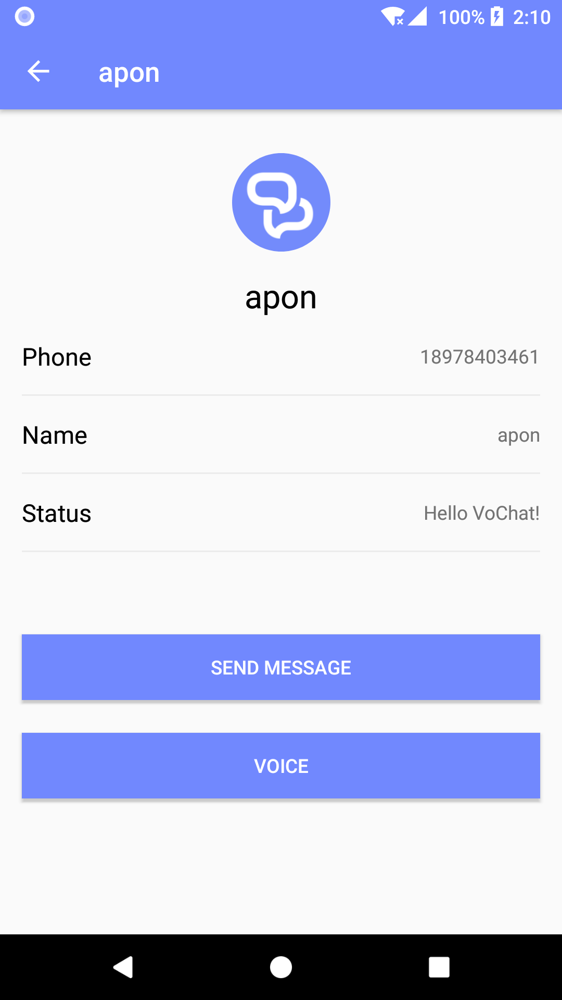

# VoChat-Android
这是一个简单的IM/VOIP App,学习kotlin的练手项目。

服务器端是用PHP基于GatewayWorker写的。[VoChat-Service](https://github.com/apon/VoChat-Service)

下载：

[https://fir.im/vochat](https://fir.im/vochat)

用到的主要库有：

1. [MvRx](https://github.com/airbnb/MvRx)
2. [Moshi](https://github.com/square/moshi)
3. Room
4. [Lemon](https://github.com/apon/lemon)
5. [opus-android](https://github.com/apon/opus-android)
6. [ChatKit](https://github.com/stfalcon-studio/ChatKit)

| 登录        |   未读消息 | 重置用户名  |
| :-------------: |:-------------:| :------------:|
|      |  |  |
| 聊天界面 | 用户信息           |  消息通知  |
|      |  |  |
|发起语音聊天| 被呼叫 |  语音通话中  |
|      |  |  |

